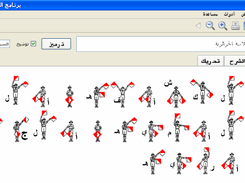
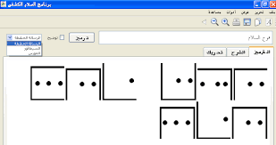

# برنامج السلام الكشفي للمخابرة

يقوم البرنامج بمساعدة الكشاف والقائد في تعلم وتعليم بعض المهارات الكشفية من خلال توفير إمكانية ترميز الكلمات من خلال تقنية المخابرة السرية، فيمكن كتابة جملة سرية وطباعتها ليتم ترجمتها من قبل الكشاف خلال رحلة خلوية.

 سبق لنا تصميم برنامج مشابه على موقع الإنترنت، وسنعيد إحياءه قريبا، على موقع http://www.bouirascout.net 
 
 ونعتقد أن توفيره على جهاز الحاسوب مهم أيضا، ليُستعمل في أي وقت.
 

 

## سلسلة برامج السلام الكشفي

هي سلسلة من البرامج التي نطمح إلى تقديمها وبرمجتها لتساعد في تعليم المهارات للكشافين من خلال:
 -برنامج للمخابرة السرية 
 - برنامج الألعاب الكشفية 
 - برنامج الموسوعة الميسرة 
 
 سميت هذه السلسلة بالسلام الكشفي، نسبة لفوج السلام بالخبوزية، ولاية البويرة، الجزائر__.
### روابط
* موقع المشروع  [http:/salamscout.sourceforge.net](http://www.bouirascout.net/salamscout.sourceforge.net "برنامج السلام الكشفي") 
* التحميل : [http://sourceforge.net/projects/salamscout/files/](http://sourceforge.net/projects/salamscout/files/) 

* الإعداد :برمجة الواجهة الرسومية :[طه زروقي، فوج السلام](http://github.com/linuxscout)

